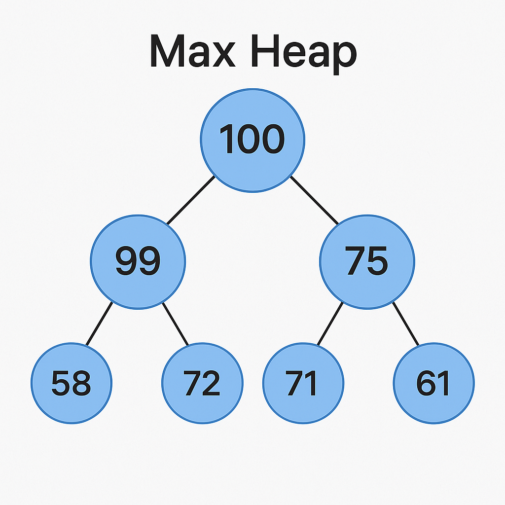

# Java Heap Implementation

This project demonstrates a simple implementation of a **Max Heap** in Java using an `ArrayList`. A max heap is a complete binary tree where each node is greater than or equal to its children.



## Features

- Insert elements into the heap.
- Remove the maximum element (the root) from the heap.
- Automatically maintains the heap property during insertion and removal.
- Provides current state of the heap via `getHeap()`.

## Project Structure

- `Main.java` – Contains the main method to demonstrate heap operations.
- `Heap.java` – Contains the logic for the heap data structure.

## How It Works

### Insertion

Elements are added at the end of the list and then "bubbled up" to maintain the heap property.

### Removal

The root element (maximum) is removed, and the last element is placed at the root and "sunk down" to maintain heap property.

## Sample Usage

```java
Heap myHeap = new Heap();
myHeap.insert(99);
myHeap.insert(72);
myHeap.insert(61);
myHeap.insert(58);
System.out.println(myHeap.getHeap()); // [99, 72, 61, 58]

myHeap.insert(100);
System.out.println(myHeap.getHeap()); // [100, 99, 61, 58, 72]

myHeap.insert(75);
System.out.println(myHeap.getHeap()); // [100, 99, 75, 58, 72, 61]

//Remove
Heap myHeap2 = new Heap();
myHeap2.insert(95);
myHeap2.insert(75);
myHeap2.insert(80);
myHeap2.insert(55);
myHeap2.insert(60);
myHeap2.insert(50);
myHeap2.insert(65);

System.out.println(myHeap2.getHeap()); // [95, 75, 80, 55, 60, 50, 65]

myHeap2.remove();
System.out.println(myHeap2.getHeap()); // [80, 75, 65, 55, 60, 50]

myHeap2.remove();
System.out.println(myHeap2.getHeap()); // [75, 60, 65, 55, 50]
